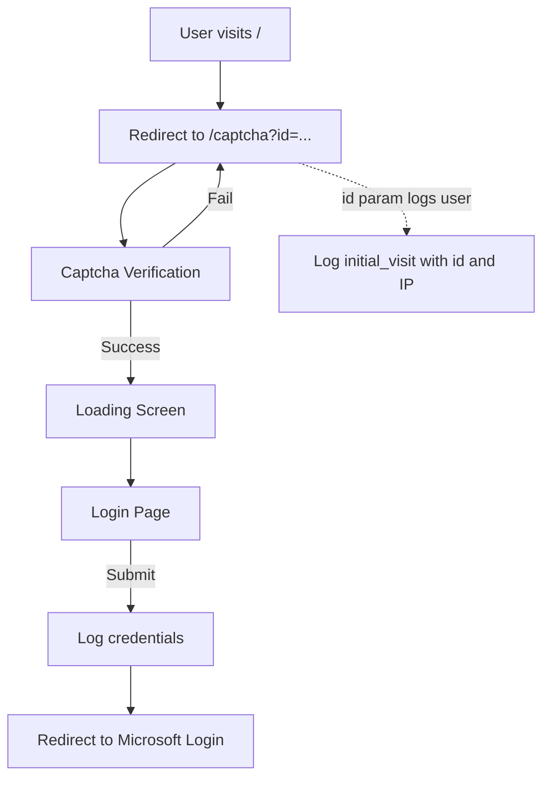

# microsoftlogin-phishing

microsoftlogin-phishing is a Flask-based phishing simulation project that mimics the Microsoft login page, collects email and password information after a captcha verification, and logs all user activity in detail. The project is designed for educational and awareness purposes only.

---

## Table of Contents
- [Features](#features)
- [How It Works](#how-it-works)
- [Setup](#setup)
- [Usage](#usage)
- [File Structure](#file-structure)
- [Technical Details](#technical-details)
- [Logging](#logging)
- [Screenshots](#screenshots)
- [Legal Disclaimer](#legal-disclaimer)

---

## Features
- **Captcha Verification:** Users must solve a captcha before accessing the login page.
- **Session Management:** Each user is tracked with a unique session.
- **Detailed Logging:** All activities (captcha, login attempts, IP, timestamp, email, password) are logged to `phish_log.csv`.
- **Password Masking:** Passwords are partially masked in logs.
- **Modern UI:** Responsive, Microsoft-style HTML/CSS interface.
- **Docker Support:** Easy deployment with Dockerfile and docker-compose.
- **Rich Static Assets:** Custom CSS, JS, and images for a realistic look.

---

## How It Works

1. **Entry Point:**
   - When a user visits `/`, they are immediately redirected to `/captcha`.
   - The application expects an `id` parameter in the URL, e.g., `/captcha?id=abc123`.
   - This `id` can be used to track individual users or campaigns.

2. **/captcha?id=... Parameter:**
   - The `id` parameter is logged as soon as the user lands on the captcha page.
   - The user's IP address and timestamp are also recorded.
   - This allows you to associate all subsequent actions (captcha, login, etc.) with a specific user or campaign.
   - If the captcha is solved correctly, the user proceeds to the loading screen, then to the login page.
   - If the captcha fails, the event is logged and the user is prompted to try again.



3. **Login Simulation:**
   - The login page first asks for an email, then for a password.
   - All submissions are logged with the associated `id` and IP address.
   - After a successful login, the user is redirected to the real Microsoft login page.

---

## Setup

### 1. Classic (Python)
```bash
git clone https://github.com/SAMI3SS/microsoftlogin-phishing.git
cd microsoftlogin-phishing
python3 -m venv venv
source venv/bin/activate
pip install -r requirements.txt
sudo python app.py
```

### 2. Docker
```bash
git clone https://github.com/SAMI3SS/microsoftlogin-phishing.git
cd microsoftlogin-phishing
docker-compose up --build
```
The app will be available at `http://localhost/` by default.

---

## Usage
1. User is redirected to `/captcha?id=...`.
2. After solving the captcha, a loading screen is shown, then the login page appears.
3. The user is asked for their email and then their password.
4. All actions are logged in `phish_log.csv`.
5. After login, the user is redirected to the real Microsoft login page.

---

## File Structure
```
microsoftlogin-phishing/
│
├── app.py                # Main Flask application
├── requirements.txt      # Python dependencies
├── dockerfile            # Docker image instructions
├── docker-compose.yml    # Docker Compose config
├── phish_log.csv         # Log file (auto-generated)
│
├── templates/            # HTML templates
│   ├── captcha.html      # Captcha page
│   ├── index.html        # Login page
│   └── loading.html      # Loading/redirect page
│
└── static/               # Static files (CSS, JS, images)
    └── assets/
        ├── app.css
        ├── app.js
        ├── logo.png, favicon.ico, ...
        └── captcha-background.png, ...
```

---

## Technical Details
- **Flask** is used as the backend framework.
- All requests are routed through `/captcha` for verification.
- Session and user tracking is handled via Flask sessions and the `id` parameter.
- All steps (captcha, loading, login) are logged with timestamp, event, id, IP, email, and password (masked).
- After successful login, users are redirected to the real Microsoft login page.

---

## Logging
All activities are logged in `phish_log.csv` in the following format:

| timestamp                | event            | id      | ip           | email         | password   |
|--------------------------|------------------|---------|--------------|---------------|------------|
| 2024-06-10T12:34:56+00:00| login_submit     | abc123  | 1.2.3.4      | user@x.com    | ab***yz    |

- **event:** The step (`initial_visit`, `captcha_success`, `login_submit`, etc.)
- **id:** The unique session or campaign id from the URL parameter.
- **ip:** The user's IP address.
- **email/password:** Entered credentials (password is masked).

---

## Screenshots
> See the `static/assets/` folder for all images and previews.
> - captcha-background.png: Captcha page background
> - logo.png: Login page logo
> - preview.gif: App preview
> - ...and more

---

## Legal Disclaimer
> **WARNING:**
> This project is for **educational and security awareness purposes only**. Any use of this code to collect real user credentials, distribute, or deploy without proper authorization is **illegal** and may result in severe consequences.
>
> **The author assumes no responsibility or liability for any misuse of this project.**
> By using this code, you agree that you are solely responsible for your actions and will use it only in legal, ethical, and authorized scenarios (such as penetration testing with explicit permission, security research, or awareness training).

---

## Bypassing Browser Phishing Warnings & Stealth Techniques

Modern browsers such as Chrome, Firefox, and Edge use "Safe Browsing" technology to warn users about potentially dangerous or phishing websites. When a site is flagged, users see a red warning screen and are strongly discouraged from proceeding.

**This project demonstrates techniques to bypass or evade these browser phishing warnings, allowing the phishing simulation to proceed without triggering the standard "Dangerous site" interstitial.**

Additionally, the project employs several stealth and obfuscation techniques in its frontend code (see `static/assets/app.js`):
- **JavaScript Obfuscation:** The main JavaScript file is heavily obfuscated, making it difficult for automated scanners and analysts to understand or flag the code as malicious.
- **Dynamic Element Handling:** UI elements and form logic are managed dynamically, further complicating static analysis.
- **Minimal Readable Strings:** Sensitive logic and selectors are encoded or split, reducing the chance of detection by signature-based security tools.

These methods help the simulation evade both browser-based and some endpoint security detections, making it more realistic for awareness training and controlled testing.

> **Note:**
> Bypassing browser warnings and using obfuscation is for educational and authorized testing purposes only. Attempting to evade browser security features on real users or in unauthorized scenarios is illegal and unethical.

---

## Contact
For questions or suggestions: [samiozcan.sec@gmail.com] 